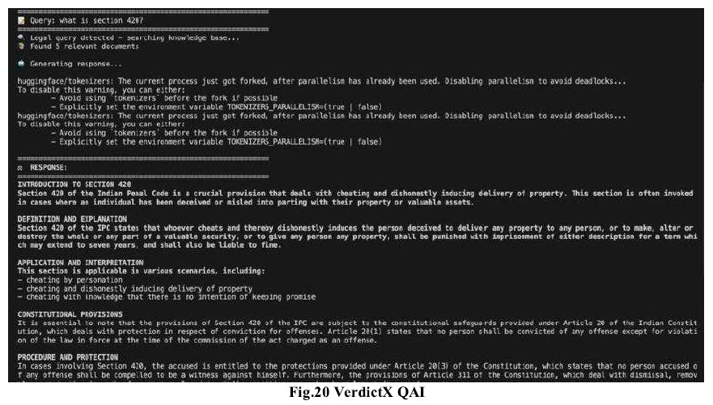

# VerdictX – AI-Powered Legal Intelligence and Judgment Prediction System

## Overview

VerdictX is an AI-powered legal intelligence platform designed to simplify legal document analysis through Natural Language Processing (NLP), Retrieval-Augmented Generation (RAG), and Large Language Models (LLMs). The platform assists legal professionals, researchers, and law students by automating information extraction, case summarization, judgment prediction, bail analysis, legal document drafting, and conversational legal assistance.

---

## Problem

Legal professionals spend significant time reviewing lengthy court judgments, identifying relevant facts, researching precedents, understanding legal provisions, and analyzing judicial outcomes. Traditional legal workflows are often manual, time-consuming, and difficult to scale.

VerdictX addresses these challenges by leveraging AI to automate legal document understanding, provide explainable insights, and enable intelligent legal interactions through a conversational interface.

---

## System Architecture

### Workflow

1. User uploads a legal case document (PDF/Text).
2. PyMuPDF extracts and preprocesses document text.
3. NLP pipelines perform:

   * Named Entity Recognition (NER)
   * Legal Information Extraction
   * Context Analysis
   * Case Understanding
4. FAISS-based semantic retrieval fetches relevant precedents and legal context.
5. LLM-powered reasoning generates:

   * Judgment Predictions
   * Bail Analysis
   * Case Summaries
   * Legal Answers
   * Legal Document Drafts
6. FastAPI backend serves AI-generated outputs.
7. React frontend displays results, downloadable reports, and conversational responses.

---

## Core Modules

### 1. Judgment Prediction

Predicts potential case outcomes using legal facts, historical judgments, and retrieved precedents.

#### Follow-Up Questions Supported

* Why was this judgment predicted?
* Which legal factors influenced the prediction?
* Which precedents were considered?
* What evidence contributed to the outcome?

---

### 2. Bail Analysis

Estimates the likelihood of bail approval based on legal context and historical judicial patterns.

#### Follow-Up Questions Supported

* Why is bail likely to be granted?
* Which factors reduced approval probability?
* What legal sections affected the analysis?
* Which similar cases were considered?

---

### 3. Information Extraction

Automatically extracts critical legal information such as:

* Case Number
* Court Name
* Judges
* Petitioner
* Respondent
* Lawyers
* Dates
* Legal Sections
* Acts
* Organizations
* Legal Citations

#### Export Feature

Generated information can be downloaded as a structured PDF report for legal review and documentation.

---

### 4. Document Drafting

Generates legal drafts based on uploaded case information and contextual legal understanding.

Examples:

* Legal Notices
* Petitions
* Case Drafts
* Legal Summaries

#### Export Feature

Generated documents can be downloaded directly in PDF format.

---

### 5. Case Summarization

Generates an intelligent summary of uploaded legal documents.

The system produces the following 11 key points:

1. Case Background
2. Parties Involved
3. Legal Issues
4. Relevant Facts
5. Arguments Presented
6. Applicable Laws
7. Important Evidence
8. Judicial Observations
9. Legal Reasoning
10. Final Decision
11. Key Takeaways

This allows users to understand lengthy judgments within minutes.

---

### 6. VerdictX QAI (Legal Question Answering Interface)

An AI-powered legal assistant capable of answering both case-specific and general legal questions.

#### Case-Specific Queries

* Who is the petitioner?
* Who was the judge?
* What sections are involved?
* What was the final verdict?
* Summarize this case.
* What evidence was considered?

#### Follow-Up Queries

* Why was this judgment predicted?
* Why was bail granted or rejected?
* Which precedent influenced the outcome?
* Explain the legal reasoning.

#### General Legal Queries

* What is Article 21 of the Indian Constitution?
* What is Section 420 IPC?
* What is a writ petition?
* What are the grounds for obtaining bail?
* Difference between civil and criminal cases.

---

## Tech Stack

### Frontend

* React.js
* HTML5
* CSS3
* JavaScript

### Backend

* Python
* FastAPI

### AI / Machine Learning

* LLaMA 3.3 70B (via Groq API)
* Legal-BERT
* Sentence Transformers
* Retrieval-Augmented Generation (RAG)
* FAISS Vector Database
* spaCy
* Regular Expressions (Regex)

### Data Processing

* PyMuPDF (fitz)
* PDFPlumber
* Pandas
* NumPy

### Machine Learning Libraries

* Scikit-Learn
* LightGBM
* XGBoost

### Database

* MongoDB

### Development Environment

* Google Colab
* VS Code
* Git
* GitHub

---

## Dataset

### Judgment Prediction Dataset

* Based on Indian Legal Documents Corpus (ILDC).
* Contains Indian court judgments and case summaries.
* Includes legal facts, arguments, legal provisions, and judicial decisions.
* Used for contextual legal reasoning and outcome prediction.

### Bail Analysis Dataset

* Bail Granted / Rejected records
* Relevant IPC and CrPC Sections
* Offense Categories
* Historical Bail Patterns

Used for bail outcome estimation and legal factor analysis.

### Information Extraction Dataset

Annotated legal documents containing:

* Case Numbers
* Judges
* Parties
* Legal Sections
* Dates
* Acts
* Citations
* Organizations

---

## Results

### Key Features Achieved

✔ Automated legal document analysis

✔ Legal information extraction

✔ Downloadable PDF reports

✔ Automated legal document drafting

✔ Downloadable drafted legal documents

✔ Explainable judgment prediction

✔ Bail probability estimation

✔ 11-point intelligent case summarization

✔ Context-aware legal question answering

✔ Conversational follow-up reasoning

✔ Semantic legal precedent retrieval using FAISS

✔ AI-powered legal assistant

### Outcomes

* Reduced manual legal document review effort.
* Improved accessibility of legal information.
* Accelerated legal research and case analysis.
* Enabled explainable AI-assisted legal reasoning.
* Generated structured legal reports and summaries.
* Improved legal knowledge discovery through conversational AI.

---

## Challenges Faced and Solutions

### Processing Long Legal Documents

**Challenge:** Court judgments often contain hundreds of pages, exceeding model context limits.

**Solution:** Implemented preprocessing and segmentation pipelines using PyMuPDF to break documents into manageable sections before analysis.

---

### Extracting Accurate Legal Entities

**Challenge:** Legal documents contain domain-specific terminology and complex references.

**Solution:** Combined Legal-BERT, spaCy NER, and regex-based extraction techniques to improve entity recognition accuracy.

---

### Retrieving Relevant Legal Context

**Challenge:** Direct LLM responses occasionally lacked supporting legal context.

**Solution:** Implemented Retrieval-Augmented Generation (RAG) using FAISS vector search to retrieve semantically relevant precedents before response generation.

---

### Prediction Explainability

**Challenge:** Legal professionals require reasoning behind AI predictions.

**Solution:** Incorporated retrieved precedents, extracted legal facts, and contextual evidence into generated explanations.

---

### Multi-Component System Integration

**Challenge:** Integrating document processing, retrieval, prediction, summarization, and conversational AI into a single workflow.

**Solution:** Adopted a modular FastAPI architecture enabling independent development and scalability of each component.

---

## Key Learnings

While building VerdictX, I gained hands-on experience with:

* Retrieval-Augmented Generation (RAG)
* Vector Search using FAISS
* Legal Domain NLP
* Named Entity Recognition (NER)
* Legal-BERT and LLM Integration
* FastAPI Backend Development
* React Frontend Development
* Explainable AI Systems
* Conversational AI Design

One of the most valuable lessons was learning that reliable AI systems depend not only on powerful models but also on effective retrieval, data quality, system architecture, and explainability.

---

## Future Scope

* Fine-Tuned Legal LLMs for Indian legal datasets
* Multi-Language Legal Support
* Real-Time Court Judgment Monitoring
* Advanced Precedent Recommendation Engine
* Explainable AI-Based Legal Reasoning
* Voice-Based Legal Assistant
* Legal Research Database Integration
* Automated Legal Document Review
* Legal Analytics and Visualization Dashboards

---

## Screenshots

### Home Page

### Information Extraction Module

### Case Summarization Module

### Judgment Prediction Dashboard

### Bail Analysis Module

### VerdictX QAI Chatbot

(Add Screenshot)

